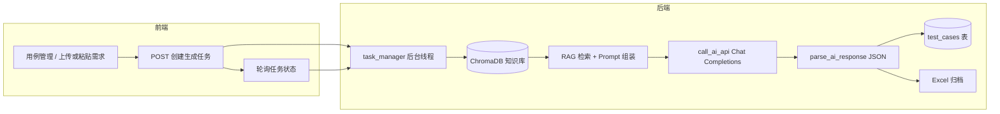

# 毕业设计答辩：AI 生成测试用例功能——如何介绍实现与优化

本文面向**口头答辩**，帮助你在有限时间内讲清：**做了什么、怎么做的、怎样提升效果、还有哪些不足**。表述已与当前仓库实现（`backend/app/routes/ai_tasks.py`、任务管理、前端轮询等）对齐，可按需删减幻灯片页数。

---

## 零、答辩常用概念：低温是什么、「效果好」指什么

### 0.1 什么是「低温」（temperature）

大模型接口里的 **`temperature`（温度）** 用来控制**同一句提示下，输出有多「随机」**。

- **取值**：常见在 **0～2** 之间（具体范围以服务商文档为准）。**数值越小 = 越「低温」**。  
- **低温（例如 0.2～0.4）**：模型更倾向选**概率最高、最稳妥**的续写方式，输出更**稳定、可重复**；更少「天马行空」、更少胡编，更适合**严格按文档写用例、输出固定 JSON** 这类任务。本项目中默认约 **0.3**，属于偏低温。  
- **高温（例如 0.8 以上）**：采样更分散，答案更多样、更有「创意」，但**格式易飘、事实易编**，不适合要强约束的结构化生成。

**答辩一句话**：低温就是让模型**少随机、多守规矩**，提高用例格式和贴合文档的稳定性。

### 0.2 本课题中「效果好」指什么

在答辩里若老师说「你说的效果好具体怎么衡量」，可用下面三条**并列说清楚**（与业务目标一致）：

1. **贴合业务**：生成的测试用例能**准确贴合实际业务功能**与需求描述，步骤、预期与真实产品行为一致，减少「看起来对、上线不对」。  
2. **少而全**：以**最小条数**的用例，**尽可能全面覆盖**文档中的测试点（主流程、关键异常与边界），避免大量重复、凑数。  
3. **清晰准确**：用例名称、步骤、预期等**描述清晰、可验证**，测试人员能直接执行或略改即用。

下文提到的「优化效果」，均围绕以上三点展开。

---

## 一、建议的讲述顺序（约 3～5 分钟口播骨架）

1. **一句话定位**：在移动端测试管理平台中，为**单个需求**提供「粘贴或上传需求文档 → 异步调用大模型 → 自动生成结构化功能用例并入库」的能力，减轻测试人员从零编写用例的负担。  
2. **为什么异步**：模型调用耗时长、可能失败，用后台任务避免阻塞 HTTP，前端轮询进度，体验更稳。  
3. **核心实现**：OpenAI 兼容的 Chat Completions API + 系统/用户双层提示词约束 JSON 输出 + 解析清洗 + 写入 `test_cases` 表。  
4. **效果相关优化（按「效果好」三条讲）**：**贴合业务**——提示词要求有据可依、低温减少胡编；**少而全**——按文档体量建议条数、要求覆盖功能点且控制重复堆砌；**清晰准确**——固定 JSON 字段、步骤与预期可验证。工程上再用动态 `max_tokens`、解析剥离等保证**长文档也能完整落库**，否则谈不上覆盖与可读。  
5. **边界诚实说**：三条效果都**强依赖需求文档**是否写清；结果需人工评审；接口用例与全量基线治理可作为后续工作。

---

## 二、业务背景（老师常问「解决什么问题」）

| 说法要点 | 答辩时可简述 |
|----------|----------------|
| 使用场景 | 需求负责人针对**本需求**文档，让系统辅助生成**功能测试用例**，人工再审核、微调。 |
| 与全量回归的关系 | 全量回归用例库宜长期人工维护；AI 更适合**需求级增量**，而非每版整库重生成。 |
| 质量期望 | 见上文「效果好」三条：**贴合业务、少而全、清晰准确**。 |

更完整的方案层面的讨论见：`docs/方案/AI测试用例生成方案说明.md`。

---

## 三、整体架构（可画在 PPT 上）



**要点说明（口述）**：

- **密钥与模型配置只在后端**（环境变量），避免泄露到浏览器。配置说明见：`docs/方案/AI用例生成配置说明.md`。  
- **异步任务**：创建任务后立即返回 `task_id`，生成在后台执行；前端定时查询 `task-status`，展示进度文案与百分比。  
- **RAG 知识库**：生成前从 ChromaDB 向量库检索相关业务知识片段，注入 Prompt 上下文，提高贴合度。  
- **Excel 归档**：每次生成结果同时导出 Excel 至 `ai/workspace/outputs/excel/`，方便离线查阅。  
- **落库后**可与现有用例管理、脑图等模块衔接（例如用脑图展示用例结构）。

---

## 四、实现层面：分模块说清楚

### 4.1 前端

- 在用例管理中选择用例集，打开「AI 生成用例」对话框：填写或上传需求文档（以文本进入后端为主，如 `.txt` / `.md`；若支持 Word 等，需在端上或后端解析为纯文本）。  
- 调用接口创建任务，**轮询**任务状态直至成功或失败；必要时脑图页可查询「该用例集是否仍在生成中」，避免用户误以为无数据。  
- 相关 API 封装可参考：`frontend/src/api/aiTasks.js`。

### 4.2 后端路由与任务

- 路由前缀：`/api/ai-tasks`。  
- `POST /generate-cases`：校验用例集、组装参数（含 `documentContent`、项目/迭代/需求等元数据用于**编号与归属**）、`task_manager.create_task` 启动 `generate_test_cases_task`。  
- 后台线程内使用 **`app.app_context()`**，保证数据库与配置在子线程中可用；并从 `backend/.env` 显式加载环境变量，避免线程内未加载配置。

### 4.3 提示词工程（直接服务「效果好」）

实现上采用 **System + User** 双消息，提示词模板以 **YAML + Jinja2** 管理（`app/ai/prompts/`），与代码分离、便于迭代：

- **System**（`system.yaml`）：强调严格依据文档、不编造、按功能点**完整覆盖**、**只输出 JSON**、不要代码块标记或废话——同时服务**贴合业务**与**少而全**。  
- **User**（`generate_cases.yaml` / `generate_cases_chunk.yaml`）：嵌入完整需求正文 + **RAG 检索到的知识库片段**，并规定 JSON 字段：`case_name`、`case_description`、`priority`、`preconditions`、`steps`、`expected_result`、`test_data` 等；要求 P0～P4、正常/异常/边界、**步骤可执行、预期可验证**——直接服务**清晰准确**；条数上按文档体量给**建议区间**，引导**少而全**而非无脑堆量。
- **ai_config.yaml**：定义 AI 角色、知识检索策略（分类优先级、top_k、相似度阈值）、用例质量标准（命名规范、优先级分布、覆盖维度）。

**答辩金句**：不是「让模型随便写一段话」，而是**用结构化输出 + RAG 知识注入 + 覆盖与条数约束**，把模型拉向「贴业务、省条数、写得清」。

### 4.4 模型调用与参数

- 使用 **OpenAI 兼容**的 `POST {base}/chat/completions`，请求体含 `model`、`messages`、`temperature`、`max_tokens`。  
- 默认 **`temperature` 偏低（如 0.3）**（见「零、0.1」）：主要目的是**少胡编、多贴文档**，服务于**贴合业务**；顺带让 JSON 格式更稳。  
- **长文档动态 `max_tokens`**：**辅助手段**——避免输出被截断后半段用例丢失，否则「少而全」里的**全**和「清晰准确」都会打折；答辩时可归入「保证效果能完整落地」，不必当成与「贴业务」并列的第一优化点。

### 4.5 解析与容错

- 从 `choices[0].message.content` 取出字符串。  
- 若模型仍包裹了 ` ```json ` 等标记，做**剥离**后再 `json.loads`，否则无法入库——属于**效果落地的工程环节**，不是「让用例更贴业务」本身。  
- 取出 `test_cases` 数组；失败时抛出明确错误信息，任务标记失败并可通知创建人。

### 4.6 持久化与编号

- 逐条写入 `TestCase`，关联 `suite_id`、`project_id`、`iteration_id`、`version_requirement_id`、`creator_id` 等。  
- **用例编号前缀**：由项目名、迭代版本、需求名等生成三段式前缀（中文经词典/pinyin 等转为缩写），尾号在集内递增，与平台其它用例编号风格一致。  
- 完成后可触发**站内通知**，告知生成成功或失败摘要。

---

## 五、如何讲「优化以提高 AI 生成效果」

**口径**：先讲清「效果好」= **贴合业务 + 少而全 + 清晰准确**（见「零、0.2」）；所有「优化」都尽量**挂到这三条上**。工程上的解析、动态 token、错误提示等，只作为**让这三条能稳定落地**的支撑，不要喧宾夺主。

建议分三层：**已做（按三维归类）**、**工程保障 + 输入流程**、**展望（仍按三维说）**。

### 5.1 已做优化——按「效果好」三维归类（答辩主战场）

| 效果维度 | 希望达到什么 | 本系统主要做法 | 代码/配置线索 |
|----------|----------------|----------------|----------------|
| **贴合业务** | 步骤、预期对准真实功能与需求，少编造 | ① 提示词要求**严格依据文档**、步骤与预期**有据可依**；② **低温**减少脱离文档的发挥；③ **RAG 知识库**自动检索相关业务知识注入上下文 | `ai_config.yaml`、`knowledge_service.py`、`_retrieve_knowledge_context` |
| **少而全** | 条数精炼，同时覆盖主流程与关键异常/边界 | ① 提示词要求按功能点**完整覆盖**；② `_suggest_case_count` 按文档长度给**建议条数区间**；③ **Map-Reduce** 长文档分段生成后合并，避免遗漏 | `_suggest_case_count`、`_generate_cases_from_document`（Map-Reduce） |
| **清晰准确** | 名称、步骤、预期写得可执行、可验证 | ① 固定 **JSON 字段**（名称、前置、步骤、预期、数据等）；② 明确要求**可执行、可验证**；③ **YAML 模板**管理输出格式，质量标准在 `ai_config.yaml` 集中定义 | `prompts/*.yaml`、`ai_config.yaml` 质量标准节 |

### 5.2 工程保障（服务于三维「能完整进系统」，不必当核心优化讲）

以下**不直接等于**「更贴业务」，但没有它们，**少而全**（长文档后半段丢失）、**清晰准确**（半截 JSON）会崩：

- **动态 `max_tokens`**：长文档抬高输出上限，减少截断。  
- **解析时剥离代码块标记**、规范 `json.loads`：保证结构化结果能入库。  
- **异步任务 + 进度 + 通知**：保证可用性，便于评审闭环。  
- **需求文档持久化**：原始文档、转换文档、提取图片分目录归档（`ai/workspace/requirements/`）。  
- **Excel 自动归档**：每次生成结果同步输出 Excel，便于离线审阅与归档。

**API Key 校验、401 提示**等属于运维与演示友好，答辩一句带过即可。

### 5.3 依赖输入与流程（三维的「上游」，往往比调参更管用）

- **贴合业务 / 清晰准确**：需求里是否有**验收标准、异常、边界**；术语是否与线上一致；结构是否清晰。  
- **少而全**：**按单需求**喂文档，避免整版本超长一次生成导致漏测或重复。  
- **三者共用**：生成结果经**人工评审**后再进正式集，避免垃圾用例污染基线。

以上内容与 `docs/方案/AI测试用例生成方案说明.md` 第 4 节一致，可回答老师「除了调模型还做了什么」。

### 5.4 展望——仍按「效果好」三维来选讲

若老师追问「还能怎么提升」，建议**每条都说明对应哪一维**：

| 方向 | 状态 | 主要加强哪一维 |
|------|------|----------------|
| **RAG 知识库检索**（业务文档 / 测试标准 / 历史问题） | **已实现** | 贴合业务 + 少而全（少漏测） |
| **Map-Reduce 分段生成再合并** | **已实现** | 少而全（长文档不漏中间功能点） |
| **Few-shot**（贴标准范例） | 待实现 | 清晰准确 + 贴合业务（风格与术语对齐） |
| **功能 / 接口分流** + OpenAPI | 待实现 | 贴合业务（接口不被散文带偏） |
| **后置校验、相似度去重** | 待实现 | 清晰准确 + 少而全（控重复条数） |
| **固定需求集评测**（人工修改量、遗漏率） | 待实现 | 用数据验证三条是否同时变好 |

---

## 六、老师可能追问 & 简要答法

**Q：生成错了谁负责？**  
A：系统定位为**辅助**；约束提示词减少编造，但最终以人工评审与版本发布流程为准。

**Q：会不会泄露需求？**  
A：当前为调用外部兼容 API，敏感项目应**脱敏**或采用**私有化部署模型**；密钥仅后端保存。

**Q：和 ChatGPT 网页版有什么区别？**  
A：平台内**异步任务、统一落库、编号与项目迭代关联、进度与通知、解析容错**，形成可重复使用的工程能力，而非一次性对话。

**Q：为什么 JSON？**  
A：便于**程序化校验与入库**；若只返回自然语言，后续自动化与统计成本更高。

---

## 七、1 分钟极简口播稿（可背诵版）

> 本系统在测试用例管理里增加了 AI 生成功能：用户针对单个需求粘贴或上传文档，后端创建异步任务，调用 OpenAI 兼容的大模型接口。优化上我按**效果好**三条来设计：**贴合业务**靠提示词要求有据可依、低温少胡编，并引入 **RAG 知识库**（5 类 18 篇业务文档经向量化后存入 ChromaDB，生成时自动检索相关片段注入上下文）；**少而全**靠覆盖要求、建议条数随文档体量变化，以及**长文档 Map-Reduce 分段生成合并**避免遗漏；**清晰准确**靠固定 JSON 字段、YAML 模板管理输出格式、质量标准集中配置。工程上用动态输出长度、解析剥离、Excel 自动归档等保证长文档也能完整落库。生成结果写入数据库并编号，同时导出 Excel，前端轮询进度。效果还依赖需求是否写清、是否按单需求生成；后续可做 Few-shot、去重、接口分流等，仍围绕这三条加强。以上是实现思路与优化要点。

---

## 八、与仓库文档的交叉引用

| 文档 | 用途 |
|------|------|
| `docs/方案/AI测试用例生成方案说明.md` | 「效果好」三维、业务分类、影响因素按维归类、与全量回归关系 |
| `docs/方案/AI用例生成配置说明.md` | 环境变量、流程图、知识库管理、常见问题 |
| `backend/app/ai/ai_config.yaml` | AI 角色、知识检索策略、质量标准、文档处理参数的中心配置 |
| `backend/app/routes/ai_tasks.py` | RAG 编排、提示词组装、调用、解析、落库、Excel 归档的核心实现 |
| `backend/app/services/knowledge_service.py` | 知识库文档向量化、ChromaDB 存储与语义检索 |

答辩前建议本地**走通一遍**：配置 `.env → 创建用例集 → AI 生成 → 列表/脑图可见**，便于演示截图或录屏。
